# 重装 macOS 系统后的软件安装与系统配置

> 系统版本：macOS Ventura 13

---

## 📁 基础配置

软件配置目录位于 `~/Library/Application Support/`

**显示隐藏文件夹快捷键：** `Command + Shift + .`

---

## 🍺 Homebrew 与常用工具安装

### Homebrew 安装

官方网站：[https://brew.sh/](https://brew.sh/)

```bash
/bin/bash -c "$(curl -fsSL https://raw.githubusercontent.com/Homebrew/install/HEAD/install.sh)"
```

### 常用工具安装

```bash
brew install wget   # wget 下载工具
brew install git    # git 版本控制工具
brew install tmux   # tmux 终端复用工具
brew install --cask iterm2  # iTerm2 终端工具
```

### 相关资源

- [iTerm2 官网](https://iterm2.com/)
- [iTerm2 配置博客](https://blog.mvpbang.com/p/09b2200a67f04867b41c1180c8a927b4/)
- [Homebrew 低版本系统支持问题解决方法](https://www.digoak.com/technology/tool/04/149/)

---

## 🛠️ Mac 辅助功能应用

### Snipaste（截图工具）

- **官网：** [https://www.snipastes.com/](https://www.snipastes.com/)
- **下载：** [Snipaste-2.11.dmg](https://download.snipaste.com/archives/Snipaste-2.11.dmg)

### Scroll Reverser（鼠标滚动方向设置）

- **官网：** [https://pilotmoon.com/scrollreverser/](https://pilotmoon.com/scrollreverser/)
- **下载：** [ScrollReverser-1.9.zip](https://pilotmoon.com/downloads/ScrollReverser-1.9.zip)

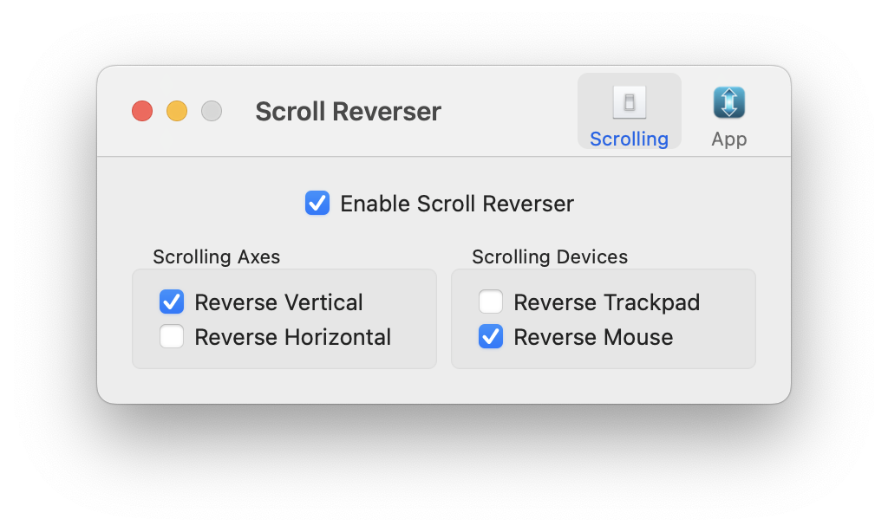

### Raycast（效率启动器）

- **官网：** [https://www.raycast.com/](https://www.raycast.com/)
- **配置文件：** [.rayconfig](configure/Raycast%202025-12-10%2015.48.34.rayconfig) `configure/Raycast 2025-12-10 15.48.34.rayconfig`

#### 配置导出（旧电脑）

1. 使用快捷键 `⌘ + ,` 打开 Raycast 设置
2. 进入 **"Advanced"** 选项卡
3. 点击 **"Export"** 按钮，生成 `.rayconfig` 文件（包含扩展、快捷键、Snippet 和设置）

> ⚠️ **注意：** 导出时可能需要设置密码，导入时需要输入该密码（默认为空）

#### 配置导入（新电脑）

1. 输入命令 **"Import Settings & Data"** 并回车
2. 选择 `.rayconfig` 文件即可完成导入

### HapiGo（快速启动工具）

- **官网：** [https://hapigo.com/](https://hapigo.com/)
- **下载：** [HapiGo.dmg](https://github.com/HapiGo/HapiGo/releases/download/2.5.3/HapiGo.dmg)

#### 配置导入

目前没有一键导入功能，需要手动将配置文件夹 `configure/Hapigo/` 复制到以下位置：

```
~/Library/Application Support/Hapigo
```

### Hammerspoon（自动化工具）

- **官网：** [https://www.hammerspoon.org/](https://www.hammerspoon.org/)
- **下载：** [Hammerspoon-1.0.0.zip](https://github.com/Hammerspoon/hammerspoon/releases/download/1.0.0/Hammerspoon-1.0.0.zip)
- **配置教程：** [Hammerspoon 博客教程](https://jishuzhan.net/article/1957239539252113410)

#### 推荐安装方式（Homebrew）

```bash
brew install --cask hammerspoon
```

#### 示例配置：长按 Cmd+Q 退出应用

```lua
-- Hold Cmd+Q to quit App

-- config: number of seconds to hold Command-Q to quit application
cmdQDelay = 1.0

cmdQTimer = nil
cmdQAlert = nil

function cmdQCleanup()
    hs.alert.closeSpecific(cmdQAlert)
    cmdQTimer = nil
    cmdQAlert = nil
end

function stopCmdQ()
    if cmdQTimer then
        cmdQTimer:stop()
        cmdQCleanup()
        hs.alert("quit canceled", 1.0)
    end
end

function startCmdQ()
    local app = hs.application.frontmostApplication()
    cmdQTimer = hs.timer.doAfter(cmdQDelay, function() 
        app:kill()
        cmdQCleanup()
    end)
    cmdQAlert = hs.alert("hold to quit " .. app:name(), true)
end

cmdQ = hs.hotkey.bind({"cmd"}, "q", startCmdQ, stopCmdQ)
```

### Karabiner-Elements（键盘映射工具）

- **官网：** [https://karabiner-elements.pqrs.org/](https://karabiner-elements.pqrs.org/)
- **配置文件位置：** `~/.config/karabiner/karabiner.json`
- **配置教程：** [Karabiner 博客教程](https://www.onejar99.com/mac-keyboard-en-zh-switch-by-karabiner-elements/)

#### 功能说明

将 **CapsLock** 切换输入法变为 **左右 Shift**

#### 推荐安装方式（Homebrew）

```bash
brew install --cask karabiner-elements
```

#### 配置示例：左 Shift 切换输入法

```json
{
    "description": "Press left_shift alone produces control + space to switch EN/ZH",
    "manipulators": [
        {
            "from": {
                "key_code": "left_shift",
                "modifiers": { "optional": ["any"] }
            },
            "to": [{ "key_code": "left_shift" }],
            "to_if_alone": [
                {
                    "key_code": "spacebar",
                    "modifiers": ["left_control", "option"]
                }
            ],
            "type": "basic"
        }
    ]
}
```

> 💡 **提示：** 右 Shift 配置只需将上述 JSON 中的 `left` 改为 `right`

---

## 🔓 Mac 破解软件安装指南

### 资源网站

[Mac 俄罗斯 Ru 盗版软件网站](https://appstorrent.ru/)（TNT 团队发布）

### 常见问题：应用已损坏

macOS 的安全机制（Gatekeeper）会拦截非官方签名的应用，提示 **"应用已损坏，打不开（Image/Application is damaged）"**

### 解决方案

#### 方案一：针对特定应用（推荐）

```bash
sudo xattr -rd com.apple.quarantine /Applications/应用名称.app
```

#### 方案二：全局禁用检查（不推荐）

```bash
sudo spctl --master-disable
```

> ⚠️ **警告：** 方案二会降低系统安全性，仅在必要时使用

---

## 📦 破解软件安装详解

### Alfred 5（效率工具）

- **下载地址：** [Alfred 5 ISO](https://psv4.userapi.com/s/v1/d2/pTZFxt-GwtGMHYgOol5iiJce94Uo5G8pOh0N9065ragSGH2hrV_IQvlrqTPjOw-_KyCw9q2kv_LTEycX7ypobs_ONEMwYblNxHfPJCUqemYQxl-IC7vSzZoBytwQ8fpvl8ZgwvUExS5m/Alfred_5_7_2_EDiSO.iso)
- **主要功能：** 剪贴板管理

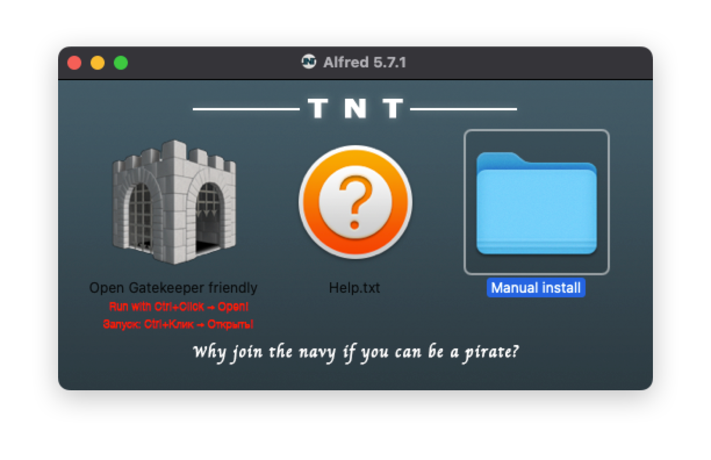

#### 安装步骤

##### 第一步：将软件拖入应用程序文件夹

1. 双击打开镜像中的 **"Manual install"** 文件夹
2. 找到 **Alfred 5.app**
3. 将其拖拽到 Mac **"应用程序 (Applications)"** 文件夹中

> ⚠️ **注意：** 此时不要急着打开，可能会报错

##### 第二步：使用终端修复权限（推荐）

1. 在终端中输入以下命令（**不要按回车**）：
   ```bash
   sudo xattr -rd com.apple.quarantine 
   ```
   （注意：`quarantine` 后面必须有一个空格）

2. 打开 Finder 的"应用程序"文件夹，找到 **Alfred 5** 图标

3. 将 **Alfred 5** 图标直接**拖拽**到终端命令后面，终端会自动补全路径：
   ```bash
   sudo xattr -rd com.apple.quarantine /Applications/Alfred\ 5.app
   ```

4. 按 **回车键 (Enter)**

5. 输入密码（输入时不显示任何字符，这是正常的）

6. 再次按 **回车键**，执行成功会直接跳到下一行

#### 其他安装选项说明

- **左侧城堡图标 (Open Gatekeeper friendly)：**  
  自动脚本。按住 `Control` 键点击图标，选择"打开（Open）"可自动执行修复

- **关于 Option II (`sudo spctl --master-disable`)：**  
  ⚠️ **强烈不建议使用**，会全局关闭 Gatekeeper 安全检查，带来极大安全风险

#### 配置文件

1. [配置文件夹](configure/Alfred): `configure/Alfred/`
2. [终端配置](configure/terminalfinder.alfredworkflow)
3. [VSCode 工作流配置](configure/alfred-open-with-vscode-workflow.alfredworkflow)
4. [表情包配置](configure/Emoji%20Pack%20Update.alfredsnippets)

### AlDente（电池管理）

- **下载地址：** [AlDente ISO](https://psv4.userapi.com/s/v1/d2/N7xtXlVhBn9JhZgQl_FT-BaM5QzM6k7UTgMg9mOe3mMRqL820gr3deJYPtrbh2j_iSNeFR8N1mKkzqHG0Ue99CKldShSBE8HuFAYxc-k2MvYnncew5eQiRBifsE5059yfGjVHAPS6psr/AlDente_1_36_1_atb.iso)
- **解决方案：** [程序无法打开？](https://appstorrent.ru/200-mistakes.html)

#### 安装说明

安装时需要在 **"隐私与安全性"** 中：
1. 允许 **"任何来源"**
2. 同意 AlDente 的权限

| 隐私设置步骤 1 | 隐私设置步骤 2 |
|:---:|:---:|
| 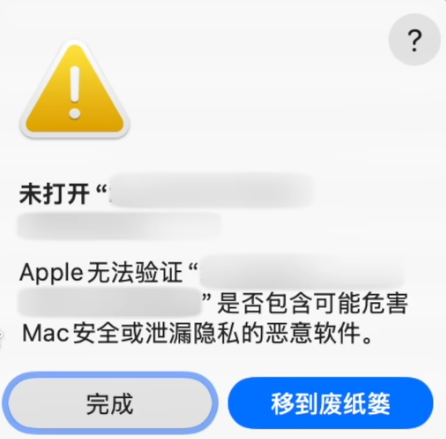 | 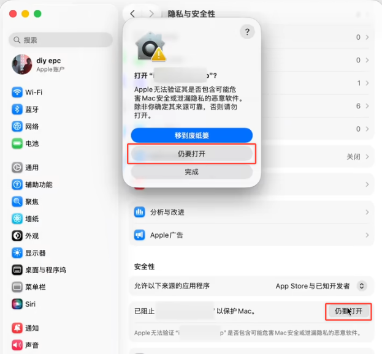 |

#### 显示效果

| 供电给显示屏 | 供电给显示屏和电池 |
|:---:|:---:|
| 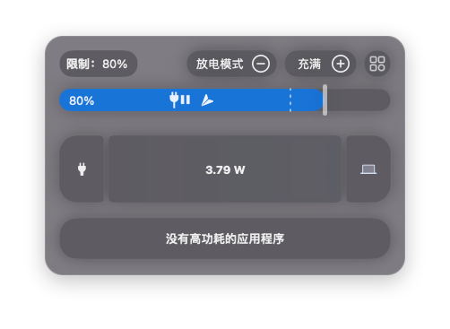 | 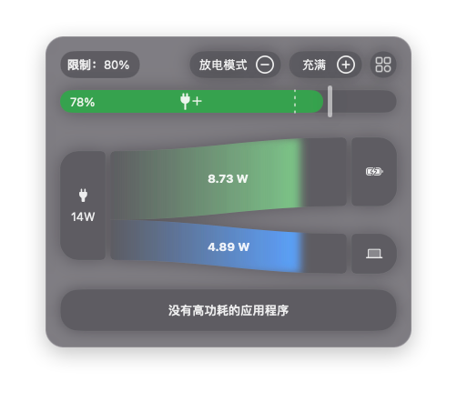 |

### Multitouch（触控板快捷设置）

- **下载地址：** [Multitouch ISO](https://psv4.userapi.com/s/v1/d2/denuvsY391YuR4HVZVG0OTOFmed93ER5CofpNZLQ12LCtxPE0IeOCt8GtPQn669VIGFdV6ZPvxUVe8t3xPAfEO-DV4kXs79hagirS8UFFjHwJnTuTQhQG88IYx0xog6vbtrNOSJ9CTad/Multitouch_1_41_TNT.iso)

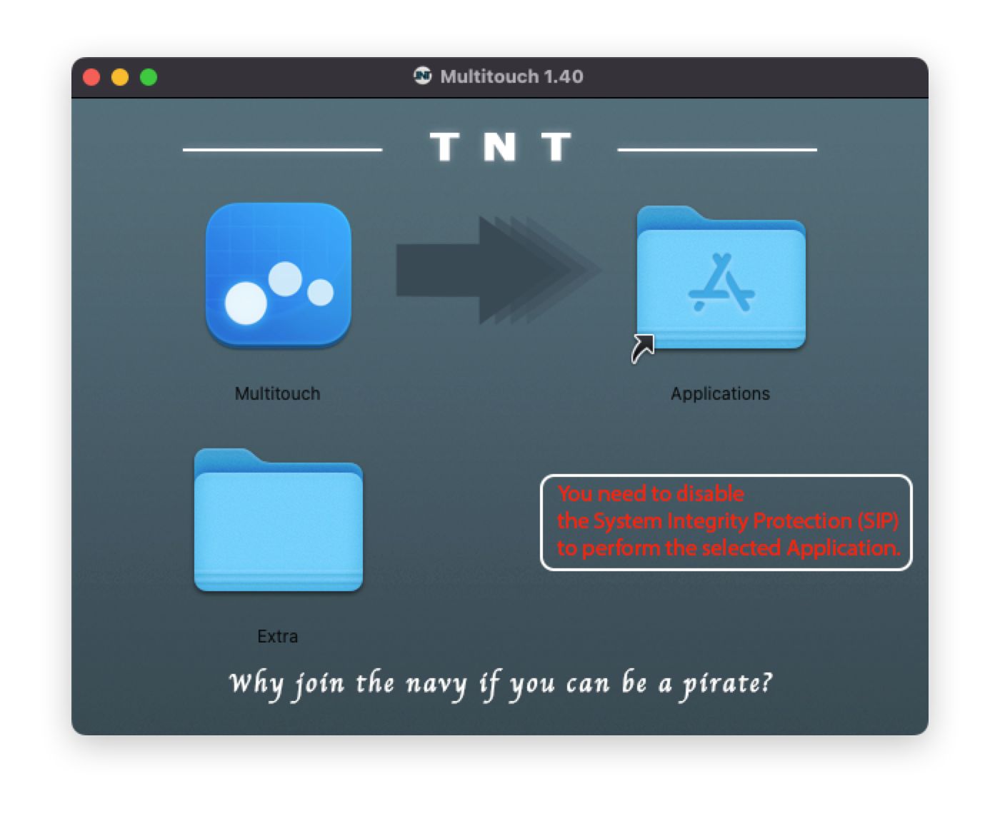

#### ⚠️ 重要安全提示

红字提示 **"You need to disable the System Integrity Protection (SIP)"** 表示需要关闭系统完整性保护。

**SIP (System Integrity Protection)** 是 macOS 的核心安全功能，**关闭它会降低电脑的安全性**。

> 💡 **建议：** 软件安装成功并运行一次后，重新开启 SIP

#### 安装步骤

##### 第一阶段：通用命令

1. **拖拽安装：** 将 `Multitouch` 拖进 `Applications`（应用程序）文件夹

2. **终端修复：**
   ```bash
   sudo xattr -rd com.apple.quarantine 
   ```
   （注意最后有空格）

3. 将应用程序中的 **Multitouch** 拖到终端命令后面

4. 按回车，输入密码

##### 第二阶段：关闭 SIP

###### 1. 进入 macOS 恢复模式（Apple Silicon 芯片）

1. 关机
2. 按住电源键直到屏幕显示 **"正在载入启动选项"**
3. 点击 **"选项 (Options)"**，然后点击 **"继续"**
4. 输入管理员账号密码

###### 2. 在恢复模式下执行命令

1. 点击顶部菜单栏的 **"实用工具 (Utilities)"**
2. 选择 **"终端 (Terminal)"**
3. 输入以下命令并回车：
   ```bash
   csrutil disable
   ```
4. 终端提示 SIP 已禁用，输入 `reboot` 回车重启

###### 3. 安装/运行软件

电脑重启后：
1. 尝试运行 Multitouch
2. 如果之前未执行 `xattr` 命令，建议再执行一次

##### 第三阶段：重新开启 SIP（推荐）

1. 重复第二阶段步骤进入**恢复模式**
2. 打开**终端**
3. 输入以下命令并回车：
   ```bash
   csrutil enable
   ```
4. 重启电脑

### Adobe Acrobat Pro DC

- **下载地址：** [Adobe Acrobat ISO](https://psv4.userapi.com/s/v1/d2/ailFViVemiLXZ-HpKlXf2flDxtVZl3KARkQdf-7i0SiE0wQ9Kbr2_09jdKP0mA8yh8msWCDKNkNp_xeMyzN6ZV6hTxeXipAz35mE5BUvMn_dOU3qdhQ1dHsaX8T_dSWBheMRmAO5b86-/Adobe_Acrobat_Pro_DC_v25_001_20756_Adobe_Activation_Tool.iso)

#### 安装步骤

##### 第一步：安装运行环境（文件夹 `1. Creative Cloud`）

- 打开 `1. Creative Cloud` 文件夹，双击运行 `.pkg` 安装包
- Adobe Acrobat 需要依附于 Creative Cloud 框架才能运行

> 💡 **提示：** 如果已安装 Adobe Creative Cloud，可跳过此步骤

##### 第二步：安装 Acrobat 主程序（文件夹 `2. Install Acrobat`）

- 打开 `2. Install Acrobat` 文件夹
- 双击运行 `Acrobat DC SCA Installer.pkg`

> ⚠️ **重要警示：** 安装过程中遇到 **"Adobe Genuine Service"** 步骤时，**务必取消勾选**（否则会不断提示软件非正版）

##### 第三步：激活软件（文件夹 `3. Crack`）

推荐使用 **v1.2.3** 版本（更稳定）

###### 准备工作

1. 打开刚才安装的 **Adobe Acrobat** 或 **Creative Cloud**
2. **登录** Adobe 账号（建议注册新的免费账号，不要用主账号）
3. 如果弹出"试用"或"购买"窗口，直接关闭并完全退出程序（`Command + Q`）

###### 开始激活

1. 打开 `3. Crack` 文件夹，打开磁盘镜像文件（`.dmg`）
2. 双击运行 **Adobe Activation Tool**
3. 确认工具识别到 **Adobe Acrobat Pro DC**
4. 点击 **"Start Activation"**（开始激活）
5. 等待显示绿色的 **"Activation completed successfully"**（激活成功）

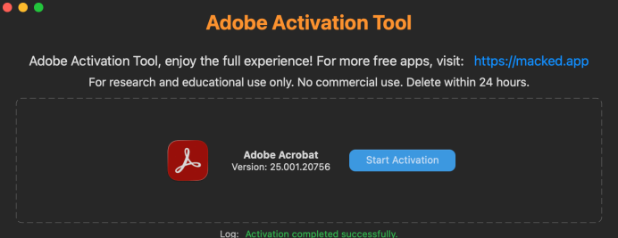

### AltTab（窗口切换工具）

- **下载地址：** [AltTab ISO](https://psv4.userapi.com/s/v1/d2/xswG_h4sqfPdF5RC4Q64YBYlNIzuCsV-YeKfDUmePhaMnglxFacFYRBs4UYCEYL-khu-dpxgBoq-y9YWaNPJSvYRQ9pHrD6LdTNlv4nywmlCujlHpF3TaFjXdwW6FVMS1Lfb25NgxfYA/AltTab-7_38_0.iso)

### 微软 Office 2019

- **下载地址：** [Microsoft Office 2019 PKG](https://officecdn.microsoft.com/pr/C1297A47-86C4-4C1F-97FA-950631F94777/MacAutoupdate/Microsoft_Office_16.53.21091200_Installer.pkg)

#### 安装步骤

1. 安装 Office 2019（安装后**不要打开**）
2. 安装破解文件：[Microsoft Office 2019 VL 序列化程序](https://appstorrent.ru/index.php?do=download&id=0)

---

## 🔐 VPN 软件

### Clash Verge

- **下载地址：** [Clash.Verge_2.4.3_aarch64.dmg](https://gitlab.com/bvpn/client/-/raw/main/Clash.Verge_2.4.3_aarch64.dmg)

### aTrust

- **下载地址：** [https://download.hla-tech.com:9010/](https://download.hla-tech.com:9010/)

### EasyConnect

- **下载地址：** [https://stuvpn.fudan.edu.cn/portal/#!/login](https://stuvpn.fudan.edu.cn/portal/#!/login)

通过 Safari 浏览器访问 VPN 登录地址，首次登录时会自动触发 EasyConnect 下载提示，选择 Mac 版安装包

---

## 🐍 Python 环境配置

### Anaconda3

- **下载地址（清华镜像）：** [https://mirrors.tuna.tsinghua.edu.cn/anaconda/archive/](https://mirrors.tuna.tsinghua.edu.cn/anaconda/archive/)

#### 推荐版本

**Anaconda3-2022.10-MacOSX-arm64.sh**（默认 Python 3.9，Shell 脚本安装包）

#### 安装步骤

##### 第一步：打开终端并运行脚本

```bash
bash /Users/chen/Downloads/Anaconda3-2022.10-MacOSX-arm64.sh
```

##### 第二步：按照提示进行交互

1. **欢迎界面：** 看到 `Welcome to Anaconda3...` 时，按 **回车 (Enter)** 继续

2. **阅读协议：** 屏幕显示许可协议
   - 按 **回车** 向下滚动，或按 **空格键** 快速翻页
   - 直到看到提示：`Do you accept the license terms? [yes|no]`

3. **接受协议：** 输入 `yes` 并按回车

4. **确认安装路径：**
   - 系统提示安装位置（通常是 `/Users/chen/anaconda3`）
   - 直接按 **回车 (Enter)** 确认使用默认路径
   - 屏幕开始滚动安装进度（需要几分钟）

##### 第三步：关键设置（初始化）

安装快结束时，会出现重要提示：

```
Do you wish the installer to initialize Anaconda3 by running conda init? [yes|no]
```

- **请务必输入：** `yes`
- **然后按回车**

> 💡 **说明：** 这会将 Anaconda 添加到系统环境变量，否则终端输入 `conda` 会提示"找不到命令"

##### 第四步：生效与验证

**重启终端并验证安装：**

```bash
conda --version
```

如果显示类似 `conda 22.9.0`，说明安装成功

#### 常见问题

**如果第三步忘记输入 `yes` 怎么办？**

手动激活：

```bash
source /Users/chen/anaconda3/bin/activate
conda init zsh
```

然后重启终端即可

---

## 🖥️ 终端配置

### tmux（终端复用工具）

- **官网：** [https://github.com/tmux/tmux/wiki](https://github.com/tmux/tmux/wiki)
- **配置文件位置：** `~/.tmux.conf`
- **博客：** [阮一峰的Tmux 使用教程](https://www.ruanyifeng.com/blog/2019/10/tmux.html)

#### 配置文件示例

```bash
# 设置历史缓存的行数（例如：50000行）
set -g history-limit 50000

# 设置状态栏颜色
set -g status-bg '#666666'
set -g status-fg white

# 状态栏左侧显示会话名和窗口编号/名称
set -g status-left '#[fg=green]S:#S #[fg=yellow]W:#I #W'

# 状态栏右侧显示时间和日期
set -g status-right '#[fg=cyan]%H:%M %d-%b-%y'

# 状态栏居中
set -g status-justify centre

# List of plugins
set -g @plugin 'tmux-plugins/tpm'
# Other plugins go here...

# Initialize TMUX Plugin Manager (keep this line at the very bottom of tmux.conf)
run '~/.tmux/plugins/tpm/tpm'
```

### Starship（终端美化）

- **官网：** [https://starship.rs/guide/](https://starship.rs/guide/)
- **配置文件位置：** `~/.config/starship.toml`

#### 终端效果图

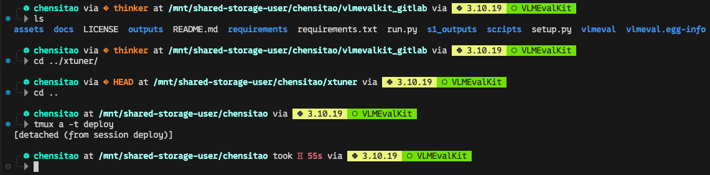

#### 安装步骤（正常用户）

安装目录：`/usr/local/bin`

```bash
# 1. 安装 Starship
curl -sS https://starship.rs/install.sh | sh

# 2. 在 Shell 中启用 Starship（初始化脚本放在末尾）
# zsh
echo 'eval "$(starship init zsh)"' >> ~/.zshrc
source ~/.zshrc

# 3. 配置 Starship
cp configure/starship.toml ~/.config/starship.toml
```

#### 安装步骤（服务器用户）

安装目录：`~/.local/bin`（不需要 sudo 权限）

```bash
# 1. 确保目录存在
mkdir -p ~/.local/bin

# 2. 安装 Starship（不需要 sudo）
curl -sS https://starship.rs/install.sh | sh -s -- -b ~/.local/bin

# 3. 后面步骤同上
# starship --version  # 检查安装是否成功
```

#### 配置文件示例 [`configure/starship.toml`](configure/starship.toml)

```toml
format = """\
[╭╴](fg:arrow)\
$username\
$os\
$git_branch\
(\
    at \
    $directory\
)\
$cmd_duration\
(\
    via \
    $python\
    $conda\
    $nodejs\
    $c\
    $rust\
    $java\
)
[╰─](fg:arrow)$character\
"""
# Add the modules you need

# Disable the blank line at the start of the prompt
add_newline = true


palette = "normal"


[palettes.normal]
arrow = "#333533"
os = "#16f4d0"
os_admin = "#e4ff1a"
directory = "#9ffff5"
time = "#bdfffd"
node = "#a5e6ba"
git = "#f17f29"
git_status = "#DFEBED"
python = "#edf67d"
conda = "#70e000"
java = "#F86279"
rust = "#ffdac6"
clang = "#caf0f8"
duration = "#ce4257"
text_color = "#EDF2F4"
text_light = "#26272A"

# I disabled some modules (Rust, Java...) since some things aren't installed in my machine, enable them if you need.

[username]
style_user = 'bold os'
style_root = 'bold os_admin'
format = '[ $user](fg:$style) '
disabled = false
show_always = true

[os]
format = "on [($name)]($style) "
style = "bold blue"
disabled = true

[os.symbols]
Alpine = " "
Arch = " "
Debian = " "
EndeavourOS = " "
Fedora = " "
Linux = " "
Macos = " "
Manjaro = " "
Mint = " "
NixOS = " "
openSUSE = " "
Pop = " "
SUSE = " "
Ubuntu = " "
Windows = " "

[character]
success_symbol = "[󰍟](fg:arrow)"
error_symbol = "[󰍟](fg:red)"

[directory]
format = "[$path](bold $style)[$read_only]($read_only_style) "
truncation_length = 10
style = "fg:directory"
read_only_style = "fg:directory"
before_repo_root_style = "fg:directory"
truncation_symbol = "…/"
truncate_to_repo = false
read_only = "  "

[time]
disabled = true
format = "at [󱑈 $time]($style)"
time_format = "%H:%M"
style = "bold fg:time"

[cmd_duration]
format = "took [ $duration]($style) "
style = "bold fg:duration"
min_time = 500

[git_branch]
format = "via [$symbol$branch]($style) "
style = "bold fg:git"
symbol = " "

[git_status]
format = '[ $all_status$ahead_behind ]($style)'
style = "fg:text_color bg:git"
disabled = true

[docker_context]
disabled = true
symbol = " "

[package]
disabled = true

[fill]
symbol = " "

[nodejs]
format = "[ $symbol$version ]($style)"
style = "bg:node fg:text_light"
symbol = " "
version_format = "${raw}"
disabled = false

[python]
disabled = false
format = '[ ${symbol}${pyenv_prefix}(${version})( \($virtualenv\)) ]($style)'
symbol = " "
version_format = "${raw}"
style = "bg:python fg:text_light"

[conda]
format = "[ $symbol$environment ]($style)"
style = "bg:conda fg:text_light"
ignore_base = false
disabled = false
symbol = " "

[java]
format = "[ $symbol$version ]($style)"
style = "bg:java fg:text_light"
version_format = "${raw}"
symbol = " "
disabled = true

[c]
format = "[ $symbol($version(-$name)) ]($style)"
style = "bg:clang fg:text_light"
symbol = " "
version_format = "${raw}"
disabled = true

[rust]
format = "[ $symbol$version ]($style)"
style = "bg:rust fg:text_light"
symbol = " "
version_format = "${raw}"
disabled = true
```

### 0xProto Nerd Font（编程等宽字体）

- **官网：** [https://www.nerdfonts.com/font-downloads](https://www.nerdfonts.com/font-downloads)
- **下载链接：** [0xProto.zip](https://github.com/ryanoasis/nerd-fonts/releases/download/v3.4.0/0xProto.zip)

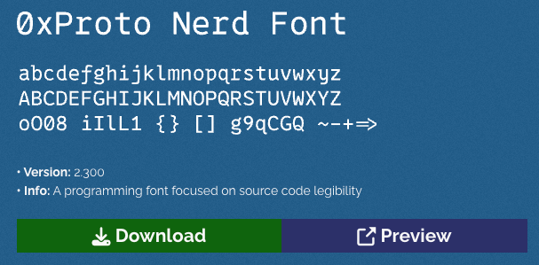

> ⚠️ **重要说明：** 仅仅在 macOS 系统中**安装**字体（双击安装）是不够的，必须显式地告诉终端软件（如 iTerm2、系统自带终端、VS Code 等）**去使用这款字体**

#### 1. iTerm2（推荐）

1. 打开 iTerm2，按 `Command + ,` 打开 **Settings（设置）**
2. 点击上方的 **Profiles（配置）** 标签
3. 点击右侧的 **Text（文本）** 标签
4. 找到底部的 **Font（字体）** 区域
5. **关键步骤：** 点击下拉菜单或"Change Font"按钮，搜索并选择 **`0xProto Nerd Font`**（或 `0xProto Nerd Font Mono`）
   > 💡 **注意：** 一定要选带有 "Nerd Font" 字样的版本，不要选原版 "0xProto"
6. **检查连字（Ligatures）：** 勾选 "Use ligatures" 以确保编程连字显示正常
7. **旧版 iTerm2 注意：** 如果版本较老，可能有 "Use a different font for non-ASCII text" 选项，建议取消勾选，或将该字体也设置为 0xProto Nerd Font

#### 2. macOS 自带终端（Terminal.app）

> 📌 **说明：** 系统自带终端对字体的回退机制支持较差，必须严格设置

1. 打开终端，按 `Command + ,` 打开 **偏好设置**
2. 点击 **描述文件（Profiles）**
3. 在右侧找到 **文本（Text）** 标签页
4. 在 **字体（Font）** 一栏，点击 **更改（Change）**
5. 在弹出的字体列表中，找到并选中 **`0xProto Nerd Font Mono`**
   > 💡 **提示：** 如果找不到，在字体列表底部的搜索框输入 "0xProto" 或 "Nerd"

#### 3. VS Code 集成终端

1. 打开 VS Code 设置（`Command + ,`）
2. 搜索 `terminal.integrated.fontFamily`
3. 在输入框中填入：
   ```text
   '0xProto Nerd Font Mono'
   ```
   > 💡 **注意：** 建议加上单引号，且优先使用 Mono 版本以保证对齐

---

## 🔧 常见问题解决

### 安装软件时显示"正在等待其他安装完成..."

这种情况通常是因为 macOS 的后台安装服务（`installd` 进程）被卡住了，或者系统认为还有另一个安装程序正在运行（即使没有看到窗口）

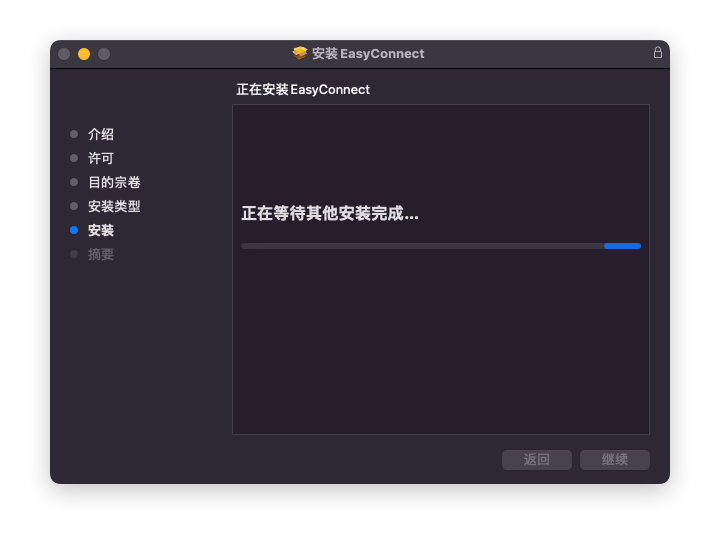

#### 解决方法

在终端中执行以下命令：

```bash
sudo killall -1 installd
```

> ⚠️ **注意：** 通过"活动监视器"（Activity Monitor）点击顶部的 X 按钮选择 **强制退出** 是不起作用的，必须使用上述命令

---

## 📝 总结

本文档涵盖了 macOS 系统重装后的完整配置流程，包括：

- 🍺 Homebrew 及常用工具安装
- 🛠️ 辅助功能应用配置
- 🔓 破解软件安装指南
- 🐍 Python 开发环境搭建
- 🖥️ 终端美化与配置
- 🔧 常见问题解决方案

建议按照文档顺序逐步配置，确保每个步骤都正确完成后再进行下一步。